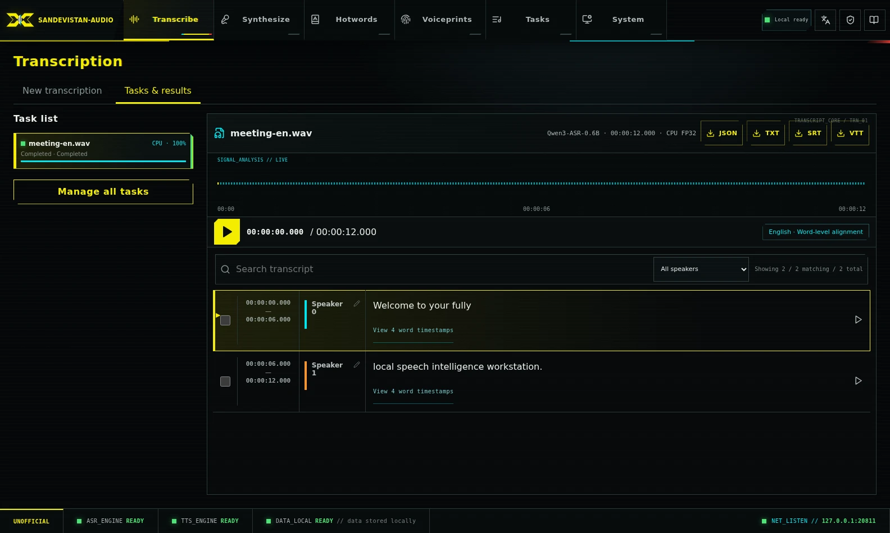
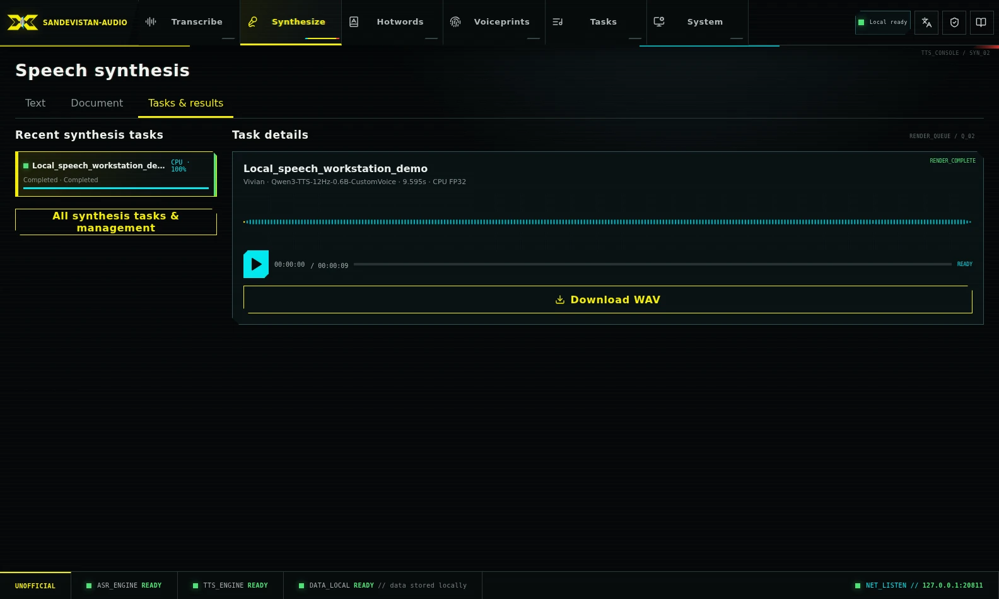
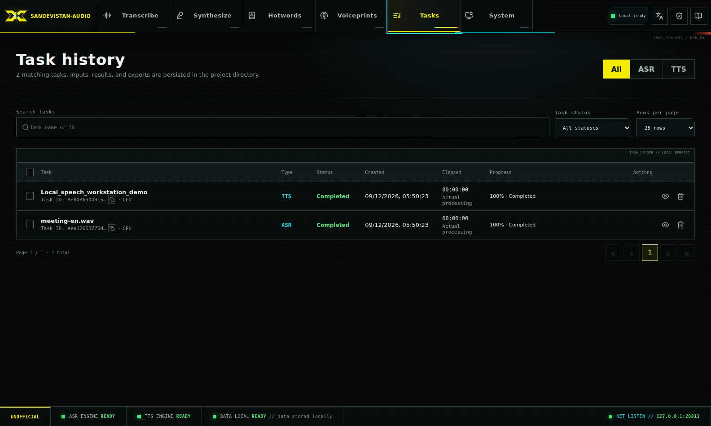
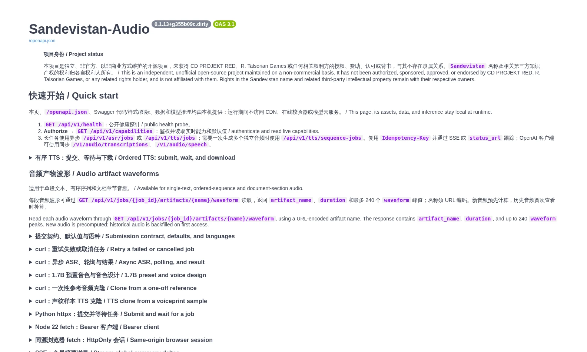

<p align="center">
  
</p>

<h1 align="center">Sandevistan Audio</h1>

<p align="center">
  <strong>A private, offline-first workstation for speech recognition and synthesis.</strong>
</p>

<p align="center">
  Turn one Linux or Windows machine into a private speech workstation: transcribe and diarize audio with word-level timestamps, manage voiceprints and hotwords, and synthesize or clone speech through a local Web UI or API.
</p>

<p align="center">
  After model setup, inference runs offline and task data stays on your machine.
</p>

<p align="center">
  <a href="README_CN.md">简体中文</a> ·
  <a href="#what-it-does">Features</a> ·
  <a href="#quick-start">Quick Start</a> ·
  <a href="#api-and-integrations">API</a> ·
  <a href="#documentation">Documentation</a> ·
  <a href="https://github.com/wlf186/audio-intel/releases">Releases</a>
</p>

<p align="center">
  <a href="https://github.com/wlf186/audio-intel/actions/workflows/linux.yml"></a>
  <a href="https://github.com/wlf186/audio-intel/actions/workflows/windows.yml"></a>
  <a href="https://github.com/wlf186/audio-intel/releases"></a>
  
  
  <a href="LICENSE"></a>
</p>

> [!IMPORTANT]
> This is an independent, unofficial open-source project maintained on a non-commercial basis. It has not been authorized, sponsored, approved, or endorsed by CD PROJEKT RED, R. Talsorian Games, or any related rights holder. See the [brand and project status notice](BRAND_NOTICE.md).

## Interface preview



<p align="center">
  
  
</p>



> [!NOTE]
> The Web UI supports Simplified Chinese and English. Use the language selector in the header or sign-in dialog; the choice is stored locally in the browser. The local Swagger API guide is also bilingual.

## What it does

| Area | Capabilities |
| --- | --- |
| **Local speech recognition** | Qwen3-ASR 0.6B/1.7B, FSMN-VAD, CAM++ speaker diarization, sentence and word timestamps, and JSON/SRT/VTT/TXT export |
| **Speaker intelligence** | Reusable voiceprint profiles name known speakers; custom and voiceprint-derived hotword lists improve domain vocabulary while completed tasks retain immutable snapshots |
| **Local voice studio** | Qwen3-TTS 0.6B/1.7B, preset voices, one-off or library-based voice cloning, 1.7B VoiceDesign, and WAV/FLAC/MP3 output |
| **Durable task engine** | Persistent SQLite queues, upload and inference progress, local ETA history, SSE updates, cancellation, retry, task history, and safe purge |
| **Web UI and APIs** | Bilingual local Web UI and Swagger guide, native asynchronous APIs, and OpenAI-compatible transcription and speech endpoints |
| **Deployment-aware operation** | Recommended full CPU/GPU profile plus an optional CPU-only profile; the UI and API expose only devices and model controls available in the active deployment |

### Why it is different

- **Local after setup.** Model revisions are pinned and runtime loading is forced offline; inputs, results, voices, the database, and logs stay in project-controlled directories.
- **Careful process isolation.** ASR and TTS use separate, incompatible Python environments and reusable supervised executors. Cancellation reaches a terminal state only after the complete task process tree exits.
- **Model-aware controls.** The UI and API expose only controls supported by the selected Qwen checkpoint and voice mode instead of silently ignoring unsupported input.

### Typical uses

- Turn multi-speaker meetings into named transcripts and subtitle files.
- Run a private local voice studio with preset voices, cloning, and 1.7B voice design.
- Add a durable speech backend to local tools through asynchronous or OpenAI-compatible APIs.

## Compatibility and hardware

The recommended **full** profile is the default. The CPU-only profile is an explicit developer choice for machines where a smaller dependency footprint matters more than inference speed.

| Profile | Runtime and behavior | Disk guidance | Choose it when |
| --- | --- | --- | --- |
| **Full — recommended** | All models and features; CPU FP32 plus NVIDIA GPU BF16 runtimes; submissions default to GPU and can explicitly use CPU | About 43 GiB for pinned models, isolated runtimes, and installation caches; 55 GiB free minimum, 70 GiB recommended | You want the supported default and may use GPU acceleration |
| **CPU-only — optional** | The same ASR/TTS models and features without CUDA, NVIDIA, or Triton packages; CPU FP32; GPU controls are disabled and explicit GPU API requests return `503` | Measured Linux core footprint—models plus project runtimes—is about 29 GiB; download/install caches and task data are additional; 40 GiB free minimum, 50 GiB recommended | You deliberately accept substantially slower inference to reduce dependency size |

| Item | Supported baseline |
| --- | --- |
| Operating systems | Ubuntu 22.04/24.04 x86_64; native Windows 11 x64 |
| NVIDIA GPU | Optional; `nvidia-smi` must work and the driver must support the pinned PyTorch CUDA runtime |
| GPU admission | 0.6B models: 3840 MiB total VRAM; 1.7B models: 7936 MiB total VRAM |
| Memory | 16 GB minimum for full setup; 32 GB recommended |

GPU admission uses total reported VRAM, not current free VRAM. Other GPU processes can still cause an out-of-memory failure. Explicit API requests for an unavailable GPU return `503` instead of silently switching to CPU; the Web UI explains the reason and selects CPU for that submission.

macOS and ARM are not validated. There is no official container image. Linux foreground mode can be used as an OCI container entrypoint, but the caller remains responsible for building the runtimes and models into the image or mounting them. Native Windows lifecycle behavior is covered by CI; real-model Windows GPU inference has not yet been validated.

## Quick Start

The commands below install the recommended full profile. Install Git, curl, tar, Node.js 22.20+ (Node.js 24 LTS recommended), and Corepack. Python 3.12 and pinned project runtimes are installed inside the repository.

### Ubuntu 22.04 / 24.04 x86_64

```bash
git clone https://github.com/wlf186/audio-intel.git
cd audio-intel

./service.sh doctor
./service.sh setup all
./service.sh start all

curl -fsS http://127.0.0.1:20810/api/v1/health
```

### Native Windows 11 x64

Use a short local NTFS path and Node.js 24 LTS:

```powershell
git clone https://github.com/wlf186/audio-intel.git C:\ai\audio-intel
Set-Location C:\ai\audio-intel

.\service.cmd doctor
.\service.cmd setup all
.\service.cmd start all

Invoke-RestMethod http://127.0.0.1:20810/api/v1/health
```

Open <http://127.0.0.1:20810>. The bilingual interactive API guide is served at <http://127.0.0.1:20810/docs>, and the machine-readable contract is at `/openapi.json`. Swagger assets and validation are hosted locally.

Developers who choose the CPU-only profile use the same startup command after profile-specific setup:

```bash
./service.sh setup all --profile cpu
./service.sh start all
```

On native Windows, use `.\service.cmd setup all --profile cpu` followed by `.\service.cmd start all`.

The selected profile is stored under `.runtime` and reused by later setup/upgrade commands. To switch profiles, stop the service, drain or cancel nonterminal jobs, then run `setup all --profile full|cpu`.

Install or start only one pipeline when you do not need the complete model set:

```bash
./service.sh setup asr   # or: tts / api
./service.sh start asr   # or: tts / api
./service.sh status
./service.sh logs all
./service.sh stop all
```

See the [Linux installation guide](docs/INSTALL.md) or [native Windows guide](docs/WINDOWS.md) for prerequisites, proxies, partial installations, foreground/container operation, and upgrades.

## How it works

```text
20810 FastAPI + local React Web UI
        │
        ├── SQLite WAL ASR queue ── ASR supervisor
        │       └── reusable task executor
        │           VAD → diarization → Qwen3-ASR → forced alignment
        │           └── JSON / SRT / VTT / TXT
        │
        └── SQLite WAL TTS queue ── TTS supervisor
                └── reusable task executor
                    Qwen3-TTS preset / clone / VoiceDesign
                    └── WAV / FLAC / MP3
```

ASR, TTS, and the internal long-reference aligner use separate Python environments because Qwen ASR and Qwen TTS require incompatible Transformers versions. ASR and TTS GPU jobs share a project-local lock so only one large model occupies the GPU at a time. Used executors stay warm briefly for burst traffic and are recycled only after their same-kind queue remains empty and the old process tree has exited.

The default-on single-task acceleration increases internal batch sizes according to hardware and model size without changing model identity, precision, diarization semantics, ASR chunking, or the sequential TTS decoder. OOM retries step down to batch 1 inside the same task. See [Architecture and capabilities](docs/ARCHITECTURE.md) for the full execution, cancellation, model, progress, and capability contracts.

## API and integrations

The four native asynchronous submission surfaces—ASR, TTS, clone-reference analysis, and voiceprint sample upload—require an 8–128 character `Idempotency-Key`. First acceptance returns `202`; a same-request replay returns `200`; reusing a key with different input returns `409`.

Minimal native ASR submission using the CPU path:

```bash
BASE_URL=${AUDIO_INTEL_BASE_URL:-http://127.0.0.1:20810}
ASR_KEY=$(python3 -c 'import uuid; print(uuid.uuid4())')

curl --fail-with-body -sS \
  -H "Idempotency-Key: $ASR_KEY" \
  -F file=@meeting.wav \
  -F language=Auto \
  -F diarize=true \
  -F align=true \
  -F compute_device=cpu \
  "$BASE_URL/api/v1/asr/jobs"
```

OpenAI-compatible synchronous transcription:

```bash
curl --fail-with-body -sS \
  -F file=@meeting.wav \
  -F model=qwen3-asr-0.6b \
  -F compute_device=cpu \
  -F response_format=verbose_json \
  "$BASE_URL/v1/audio/transcriptions"
```

Add `Authorization: Bearer $AUDIO_INTEL_API_KEY` when authentication is configured. Use the native asynchronous APIs for long tasks; they expose queue state, progress, ETA, ETag polling, and SSE. See the [API guide](docs/API.md) for TTS, cloning, hotwords, voiceprints, cancellation, retries, artifacts, Range requests, and event reconciliation.

## Documentation

| Guide | Contents |
| --- | --- |
| [Installation](docs/INSTALL.md) | Linux prerequisites, full and partial setup, proxy, directories, and service modes |
| [Native Windows](docs/WINDOWS.md) | Windows setup, lifecycle behavior, firewall, and troubleshooting |
| [API](docs/API.md) | Native asynchronous and OpenAI-compatible usage contracts |
| [Architecture and capabilities](docs/ARCHITECTURE.md) | Pipelines, models, devices, acceleration, queues, progress, and cancellation |
| [Local HTTPS](docs/HTTPS.md) | Project CA, certificate trust, SAN renewal, and fingerprint verification |
| [Troubleshooting](docs/TROUBLESHOOTING.md) | GPU, models, uploads, queues, progress, and process cleanup |
| [Upgrade](docs/UPGRADE.md) | Data backup, schema compatibility, and upgrade steps |
| [Dependency maintenance](docs/DEPENDENCIES.md) | Runtime separation, pins, locks, and security-audit notes |
| [Contributing](CONTRIBUTING.md) | Development setup, verification, and pull-request expectations |
| [Brand and project status](BRAND_NOTICE.md) | Unofficial status, third-party rights, and the boundary of the Apache-2.0 grant |

## Security and data ownership

Authentication is disabled by default for trusted local networks. Before exposing the service beyond a trusted machine or LAN, configure a strong `AUDIO_INTEL_API_KEY` and TLS:

```bash
AUDIO_INTEL_API_KEY='replace-with-a-long-random-value' ./service.sh start all
```

Browser login exchanges the key for an opaque HttpOnly same-origin session cookie; the raw key is not stored in browser storage or URLs. `/api/v1/health` remains a deliberately minimal public probe. Detailed system information, media, models, tasks, and results remain protected.

For microphone recording over a LAN IP, browsers usually require HTTPS. The project includes an offline, project-specific `mkcert` helper; follow the [local HTTPS guide](docs/HTTPS.md). Do not expose port 20810 directly to the public internet without authentication and trusted TLS.

Models, task inputs, generated outputs, the SQLite database, voices, voiceprints, caches, logs, and runtimes stay in project-local directories by default. Inputs and results persist until explicitly purged.

## Support and contributing

- Report reproducible bugs or request features through [GitHub Issues](https://github.com/wlf186/audio-intel/issues).
- Read [CONTRIBUTING.md](CONTRIBUTING.md) before changing runtime boundaries, model loading, device routing, process supervision, or public APIs.
- Review [Releases](https://github.com/wlf186/audio-intel/releases) and the [upgrade guide](docs/UPGRADE.md) before updating an existing installation.

## License

Project-owned code is licensed under the [Apache License 2.0](LICENSE). Downloaded model weights are not included in the repository and remain subject to their upstream licenses; see [third-party and model notices](THIRD_PARTY_NOTICES.md). The code license does not grant rights to third-party names or intellectual property; see the [brand and project status notice](BRAND_NOTICE.md).
