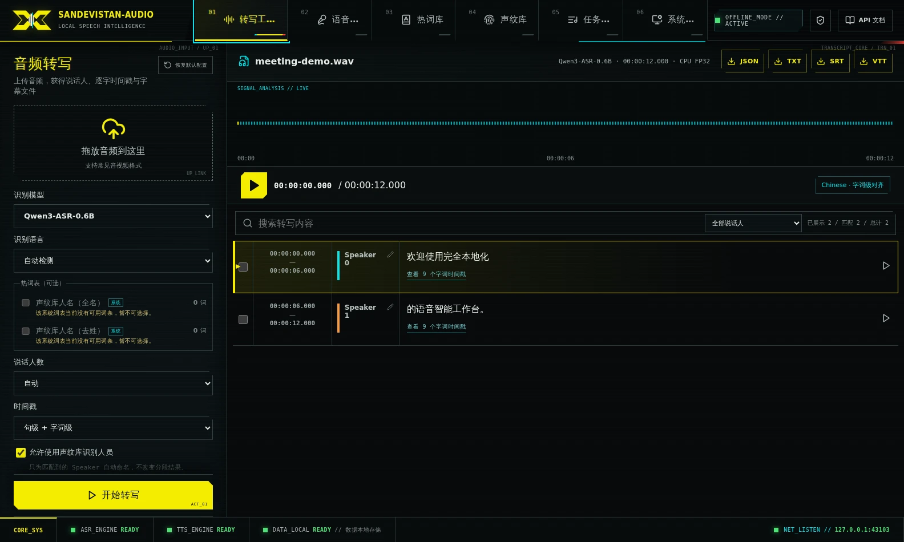
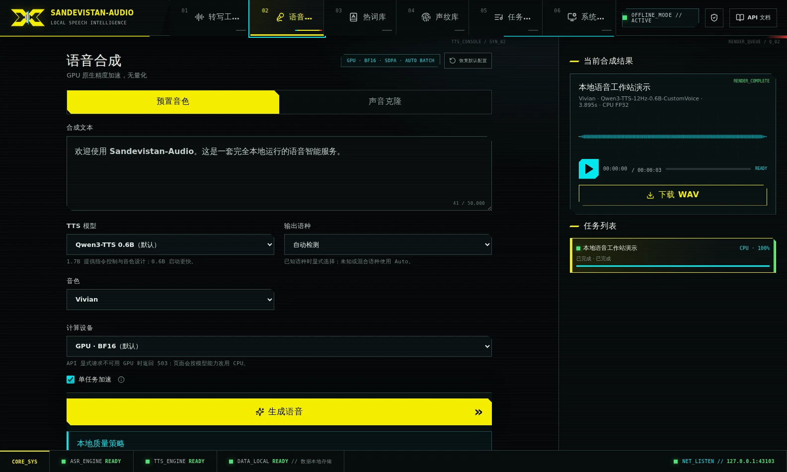
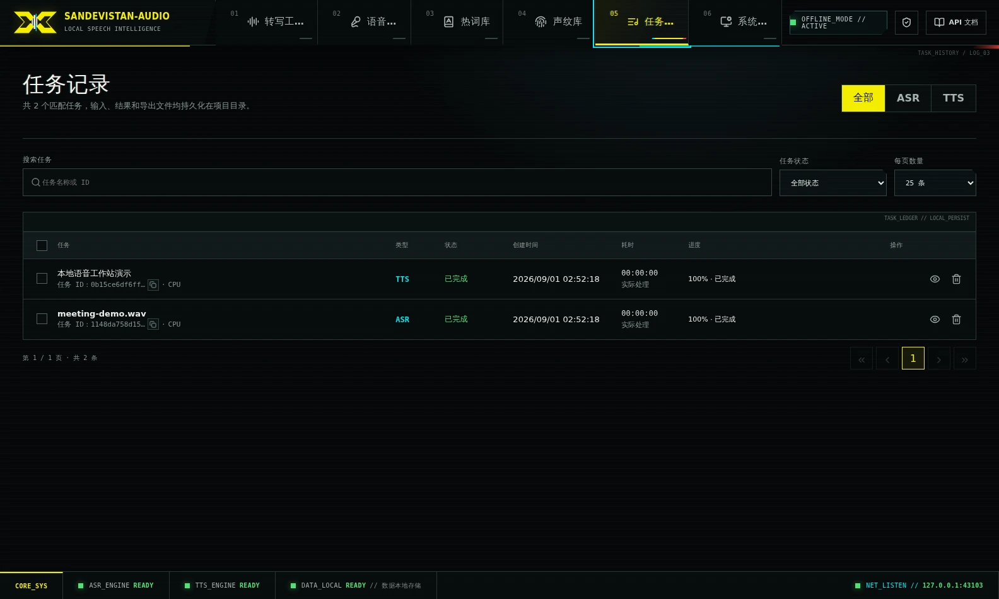

<p align="center">
  
</p>

<h1 align="center">Sandevistan Audio</h1>

<p align="center">
  <strong>面向语音识别与合成的私有、离线优先工作站。</strong>
</p>

<p align="center">
  把一台 Linux 或 Windows 电脑变成私有语音工作站：在本地完成音频转写、说话人分离、字词级时间戳、声纹与热词管理，以及语音合成和克隆，并通过 Web UI 或 API 使用。
</p>

<p align="center">
  模型安装后推理全程离线，任务数据保留在本机。
</p>

<p align="center">
  <a href="README.md">English</a> ·
  <a href="#快速开始">快速开始</a> ·
  <a href="#api-与集成">API</a> ·
  <a href="#文档">文档</a> ·
  <a href="https://github.com/wlf186/audio-intel/releases">版本发布</a>
</p>

<p align="center">
  <a href="https://github.com/wlf186/audio-intel/actions/workflows/linux.yml"></a>
  <a href="https://github.com/wlf186/audio-intel/actions/workflows/windows.yml"></a>
  <a href="https://github.com/wlf186/audio-intel/releases"></a>
  <a href="LICENSE"></a>
</p>



## 主要能力

| 范围 | 能力 |
| --- | --- |
| **语音识别** | Qwen3-ASR 0.6B/1.7B、FSMN-VAD、CAM++ 说话人分离、句段与字词时间戳、热词、声纹命名，以及 JSON/SRT/VTT/TXT 导出 |
| **语音合成** | Qwen3-TTS 0.6B/1.7B、预置音色、参考音频声音克隆、1.7B VoiceDesign，以及 WAV/FLAC/MP3 输出 |
| **本地任务系统** | SQLite 持久化队列、上传与推理进度、本机历史 ETA、SSE、取消、重试、任务记录和安全清理 |
| **集成与部署** | 原生异步 API、OpenAI 兼容转写与语音端点、本地 Web UI、CPU FP32 和 NVIDIA GPU BF16 |

### 为私有、可重复的工作流而设计

- **安装后本地运行。** 模型 revision 固定，运行期强制离线加载；输入、结果、声音、数据库和日志均位于项目可控目录。
- **一台工作站覆盖完整流程。** 无需拼装多个服务，即可完成会议转写、字幕导出、已知说话人识别、场景热词维护、语音合成和声音克隆。
- **可观察的长任务。** 提供队列位置、阶段进度、细粒度活动、ETA 热身、ETag 与 SSE，同时避免在全局列表和事件中携带完整任务结果。
- **严谨的进程隔离。** ASR 与 TTS 使用互不兼容的独立环境和可复用受监督执行器；完整任务进程树退出后，取消任务才进入终态。
- **模型感知控制。** UI 与 API 只暴露所选 Qwen checkpoint 和声音模式真正支持的控制项，不静默忽略无效参数。

### 典型用途

- 把多人会议转换成带姓名的转写结果和字幕文件。
- 使用预置音色、声音克隆和 1.7B 声音设计搭建私有语音工作室。
- 通过异步或 OpenAI 兼容 API，为本地工具提供持久化语音后端。

<p align="center">
  
  
</p>

## 快速开始

> [!IMPORTANT]
> 默认推荐的 full ASR + TTS 安装中，固定模型、隔离运行时和安装缓存合计约 **43 GiB**。至少预留 **55 GiB**、建议 **70 GiB** 可用磁盘；完整能力建议至少 **16 GB 内存**，**32 GB** 更舒适。NVIDIA GPU 可选，全部能力也提供显式 CPU 路径。

### Ubuntu 22.04 / 24.04 x86_64

需要 Git、curl、tar、Node.js 22.20+（推荐 Node.js 24 LTS）与 Corepack。Python 3.12 和固定版本的运行时会安装到项目目录：

```bash
git clone https://github.com/wlf186/audio-intel.git
cd audio-intel

./service.sh doctor
./service.sh setup all
./service.sh start all

curl -fsS http://127.0.0.1:20810/api/v1/health
```

### 原生 Windows 11 x64

建议使用较短的本地 NTFS 路径和 Node.js 24 LTS：

```powershell
git clone https://github.com/wlf186/audio-intel.git C:\ai\audio-intel
Set-Location C:\ai\audio-intel

.\service.cmd doctor
.\service.cmd setup all
.\service.cmd start all

Invoke-RestMethod http://127.0.0.1:20810/api/v1/health
```

浏览器访问 <http://127.0.0.1:20810>。Web UI 支持简体中文和英文，可在页眉或登录对话框中切换，选择会保存在当前浏览器。中英双语交互式 API 指南位于 <http://127.0.0.1:20810/docs>，机器可读契约位于 `/openapi.json`。Swagger 资源和校验器均随服务本地托管。

上述命令安装的是默认且推荐的 **full 全量配置**。开发者如明确希望精简 CPU-only 运行时，可保留全部 ASR/TTS 模型与功能，同时不安装 CUDA、NVIDIA 和 Triton 包：

```bash
./service.sh setup all --profile cpu
./service.sh start all
```

原生 Windows 使用 `.\service.cmd setup all --profile cpu`，随后执行 `.\service.cmd start all`。

CPU-only 配置在 Linux 上实测的模型与项目运行时核心占用约为 **29 GiB**，下载/安装缓存和任务数据另计；至少预留 **40 GiB**，建议 **50 GiB**，以容纳下载、升级和日常使用。推理使用 CPU FP32，速度可能明显慢于 GPU。所选配置会记录在 `.runtime`，后续安装/升级自动沿用。Web UI 会禁用 GPU 选项；API 省略设备字段时默认 CPU，显式请求 GPU 返回 `503`。切换配置前须停止服务并清空或取消未终结任务，然后执行 `setup all --profile full|cpu`。

不需要完整模型集时，可以只安装或启动一条管线：

```bash
./service.sh setup asr   # 或：tts / api
./service.sh start asr   # 或：tts / api
./service.sh status
./service.sh logs all
./service.sh stop all
```

完整前提条件、代理、部分安装、前台/容器运行与升级步骤见 [Linux 安装指南](docs/INSTALL.md)和[原生 Windows 指南](docs/WINDOWS.md)。

## 兼容性与硬件

| 项目 | 支持基线 |
| --- | --- |
| 操作系统 | Ubuntu 22.04/24.04 x86_64；原生 Windows 11 x64 |
| CPU | 全部 ASR 与 TTS 能力，FP32 |
| NVIDIA GPU | BF16；`nvidia-smi` 必须正常，驱动需支持固定的 PyTorch CUDA 运行时 |
| GPU 准入 | 0.6B 模型：总显存 3840 MiB；1.7B 模型：总显存 7936 MiB |
| 内存 | 完整安装最低 16 GB；建议 32 GB |
| 磁盘 | full：最低 55 GiB、建议 70 GiB；CPU-only Linux 参考：最低 40 GiB、建议 50 GiB |

GPU 准入读取报告的总显存而不是当前空闲显存，其他 GPU 进程仍可能导致 OOM。API 显式请求不可用的 GPU 时返回 `503`，不会静默切到 CPU；Web UI 会解释原因并为本次提交选择 CPU。

macOS 与 ARM 尚未验证，项目也没有官方容器镜像。Linux 前台模式可作为 OCI 容器入口，但调用方需负责准备或挂载运行时和模型。原生 Windows 生命周期已由 CI 覆盖，真实模型的 Windows GPU 推理尚无实机验证记录。

## 工作原理

```text
20810 FastAPI + 本地 React Web UI
        │
        ├── SQLite WAL ASR 队列 ── ASR 监督器
        │       └── 可复用任务执行器
        │           VAD → 说话人分离 → Qwen3-ASR → 强制对齐
        │           └── JSON / SRT / VTT / TXT
        │
        └── SQLite WAL TTS 队列 ── TTS 监督器
                └── 可复用任务执行器
                    Qwen3-TTS 预置 / 克隆 / VoiceDesign
                    └── WAV / FLAC / MP3
```

Qwen ASR 与 Qwen TTS 依赖互不兼容的 Transformers 版本，因此 ASR、TTS 和内部长参考对齐器使用独立 Python 环境。ASR/TTS GPU 任务共享项目内锁，同一时刻只让一个大模型占用 GPU。已使用的执行器会为突发任务保留短暂热窗口，只有同类队列持续为空且旧进程树完整退出后才会回收。

默认开启的单任务加速会根据硬件和模型大小扩大内部批次，但不改变模型、精度、说话人语义、ASR 分块或 TTS 顺序解码器。OOM 会在同一任务内逐步降到 batch 1。完整的执行、取消、模型、进度和能力契约见[架构与能力](docs/ARCHITECTURE.md)。

## API 与集成

ASR、TTS、克隆参考分析和声纹样本上传这四个原生异步提交入口都要求 8–128 字符的 `Idempotency-Key`。首次接受返回 `202`，同请求重放返回 `200`，同键更改输入返回 `409`。

使用 CPU 路径提交最小原生 ASR 任务：

```bash
BASE_URL=${AUDIO_INTEL_BASE_URL:-http://127.0.0.1:20810}
ASR_KEY=$(python3 -c 'import uuid; print(uuid.uuid4())')

curl --fail-with-body -sS \
  -H "Idempotency-Key: $ASR_KEY" \
  -F file=@meeting.wav \
  -F language=Auto \
  -F diarize=true \
  -F align=true \
  -F compute_device=cpu \
  "$BASE_URL/api/v1/asr/jobs"
```

OpenAI 兼容同步转写：

```bash
curl --fail-with-body -sS \
  -F file=@meeting.wav \
  -F model=qwen3-asr-0.6b \
  -F compute_device=cpu \
  -F response_format=verbose_json \
  "$BASE_URL/v1/audio/transcriptions"
```

启用鉴权后增加 `Authorization: Bearer $AUDIO_INTEL_API_KEY`。长任务应使用原生异步 API，以获得队列状态、进度、ETA、ETag 轮询和 SSE。TTS、克隆、热词、声纹、取消、重试、产物、Range 请求与事件校准见 [API 指南](docs/API.md)。

## 文档

| 指南 | 内容 |
| --- | --- |
| [安装与复原](docs/INSTALL.md) | Linux 前提、完整/部分安装、代理、目录和服务模式 |
| [原生 Windows](docs/WINDOWS.md) | Windows 安装、生命周期、防火墙和排障 |
| [API](docs/API.md) | 原生异步与 OpenAI 兼容使用契约 |
| [架构与能力](docs/ARCHITECTURE.md) | 管线、模型、设备、加速、队列、进度和取消 |
| [局域网 HTTPS](docs/HTTPS.md) | 项目 CA、证书信任、SAN 更新和指纹核对 |
| [故障排查](docs/TROUBLESHOOTING.md) | GPU、模型、上传、队列、进度和进程清理 |
| [升级](docs/UPGRADE.md) | 数据备份、schema 兼容和升级步骤 |
| [依赖维护](docs/DEPENDENCIES.md) | 运行时隔离、版本固定、锁文件和安全审计说明 |
| [参与贡献](CONTRIBUTING.md) | 开发环境、验证命令和 Pull Request 要求 |

## 安全与数据归属

鉴权默认关闭，适合可信本机或局域网。对外暴露前应设置强随机 `AUDIO_INTEL_API_KEY` 并配置 TLS：

```bash
AUDIO_INTEL_API_KEY='replace-with-a-long-random-value' ./service.sh start all
```

浏览器登录会把 Key 换成不透明的 HttpOnly 同源会话 Cookie；原始 Key 不进入浏览器存储或 URL。`/api/v1/health` 是有意公开的最小探针，详细系统信息、媒体、模型、任务和结果仍受保护。

通过局域网 IP 使用麦克风时，浏览器通常要求 HTTPS。项目提供离线、项目专用的 `mkcert` 助手，操作见[局域网 HTTPS 指南](docs/HTTPS.md)。未配置鉴权和可信 TLS 时，不要把 20810 端口直接暴露到公网。

模型、任务输入、生成结果、SQLite、声音、声纹、缓存、日志和运行时默认都保存在项目目录。输入与结果会持续保留，直到显式永久删除。

## 支持与贡献

- 通过 [GitHub Issues](https://github.com/wlf186/audio-intel/issues) 报告可复现问题或提出功能建议。
- 修改运行时边界、模型加载、设备路由、进程监督或公共 API 前，先阅读 [CONTRIBUTING.md](CONTRIBUTING.md)。
- 更新现有安装前查看[版本发布](https://github.com/wlf186/audio-intel/releases)和[升级指南](docs/UPGRADE.md)。

## 许可证

项目自有代码以 [Apache License 2.0](LICENSE) 发布。下载的模型权重不包含在仓库中，并继续适用各上游许可证；详见[第三方组件与模型声明](THIRD_PARTY_NOTICES.md)。

Sandevistan Audio 是非官方的赛博朋克风格界面，与相关游戏、商标或权利人不存在隶属或背书关系。
